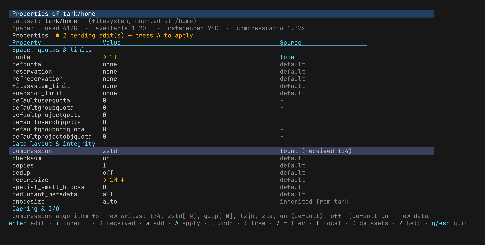
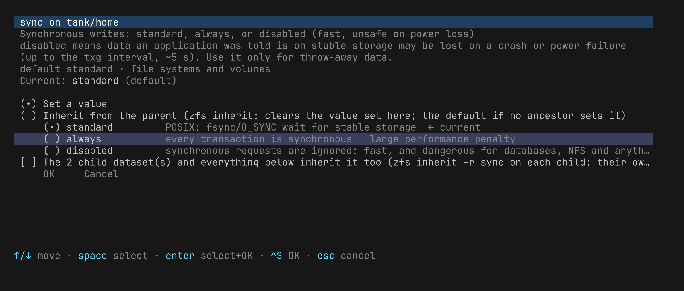

# zfs-set

A terminal UI and scripting front-end for ZFS dataset properties —
`zfs get` / `zfs set` / `zfs inherit` — for FreeBSD. Sibling of
[facl](https://github.com/olgeni/facl) and
[zfs-allow](https://github.com/olgeni/zfs-allow), same look and feel;
[zpool-set](https://github.com/olgeni/zpool-set) does the same for pools.

zfsprops(7) has a hundred properties, each with its own vocabulary
(`aclinherit=passthrough-x`, `sync=disabled`, `redundant_metadata=most`),
rules about what can be set where, and consequences that only show up later.
zfs-set lists every property of a dataset with its value and where the value
comes from, explains each one, edits them through a list of the allowed values
(with what each value means) or a validated text field, and shows the exact
`zfs set` / `zfs inherit` commands before running them — with pre-flight notes
for what zfs will refuse and what the change implies.

## Install

    go install github.com/olgeni/zfs-set@latest

or `git clone … && go build`. The man page is `zfs-set.1`; shell completions
for zsh, bash and fish are in `completions/`.

## Interactive

    zfs-set [dataset]

Without a dataset a picker lists every file system and volume, with the
dataset of the current directory preselected; `q`/`esc` from the dataset
return to the picker.

Main screen: the properties grouped by subject (mounting, space & quotas,
data layout, caching & I/O, sharing, ACLs, volumes, encryption, file names,
statistics, user properties), each with its value, its source (`local`,
`received`, `inherited from X`, `default`, `temporary`); the meaning of the
selected property is explained at the bottom. Read-only statistics and the properties fixed at creation are shown
but marked `⊘`; the properties that do nothing on FreeBSD (SELinux contexts,
`nbmand`, `sharesmb`, `vscan`, `mlslabel`, `volthreading`) are hidden until
`x`. Pending edits show as `→ value` until you apply.

| key | |
|---|---|
| enter, e | edit: set a value, inherit, or revert to the received value |
| i | inherit: clear the value set here (pending) |
| S | revert to the received value (`zfs inherit -S`, pending) |
| a | add a user property (`module:name`) or a per-key one (`userquota@NAME`…) |
| d | drop the pending edit of the property |
| A | apply: preview the commands and pre-flight notes, then run them |
| u / r | undo · reload |
| t | the property up and down the tree: every ancestor, every descendant that overrides it |
| / | filter by name or meaning · l only the properties set here · x show Linux-only |
| D | switch dataset |
| ? / h | help / keys |

Editor: the action (set / inherit — or reset to the default for the
non-inheritable ones / revert to received), then the value: a radio list of
every allowed value with its meaning, a filterable picker for long lists
(`compression` has 57), or a text field validated on the spot (sizes such as
`10G`, paths, `exports(5)` options). Options: *the children inherit it too*
(`zfs inherit -r PROP` on each child, clearing what they had) and, for
`mountpoint`/`sharenfs`/`sharesmb`, *change the property only* (`zfs set
-u`). `enter` on a value selects it and confirms.

The plan screen lists one `zfs` command per edit, the resulting value and
source of each property, and the pre-flight notes:

- what zfs will refuse: a `quota` below the used space, a `refquota` below the
  referenced space, a `volsize` that is not a multiple of `volblocksize`, a
  value that needs a pool feature which is disabled (`zstd`, `sha512`,
  `recordsize` > 128K, `dnodesize`, `longname`…), a property the dataset type
  does not have, a creation-only property, a version downgrade, `copies=3` on
  an encrypted dataset, `keylocation` off the encryption root;
- what it implies: a `mountpoint` change unmounts and remounts the file system
  and the children inheriting it (and fails when busy — `-u` changes the
  property only), `canmount=off` unmounts now, `readonly=on` is immediate,
  `compression`/`checksum`/`copies`/`recordsize`/`dedup` affect only new data,
  `sync=disabled` and `checksum=off` and `dedup` are dangerous or expensive,
  `sharenfs` needs mountd, shrinking a volume destroys data, Linux-only
  properties do nothing here, an unprivileged user needs the delegated
  permission of each property.

## Scripting

    zfs-set -list [-local] [-json] [dataset]
    zfs-set -get PROP[,PROP…] [-json] [dataset]
    zfs-set -set PROP=VALUE [-set PROP=VALUE…] [-r] [-u] [-n|-y|-check] [dataset]
    zfs-set -inherit PROP [-inherit PROP…] [-S] [-r] [-n|-y|-check] [dataset]
    zfs-set -tree PROP [-json] [dataset]
    zfs-set -where PROP [-json]
    zfs-set -dump [-r] [dataset] > F
    zfs-set -restore F [-n|-y|-check]
    zfs-set -catalogue [-json]
    zfs-set -describe PROP [-json]

`-set` and `-inherit` may be repeated; values are validated against the
catalogue before anything runs. `-r` with `-set` makes the children inherit
the new value (`zfs inherit -r` on each child), with `-inherit` it is `zfs
inherit -r`, with `-dump` it includes the descendants. `-S` with `-inherit`
reverts to the received value. `-u` with `-set` is `zfs set -u`. `-n` prints
the commands, `-check` exits 3 if anything would change (for configuration
management), `-y` applies without asking. The dataset defaults to the one the
current directory is on; a path on a ZFS file system (`.`, `/usr/local/etc`)
stands for the dataset holding it.

    $ zfs-set -set compression=zstd -r -n tank/home
    zfs set compression=zstd tank/home
    zfs inherit -r compression tank/home/alice
    zfs inherit -r compression tank/home/bob
    note: compression affects only data written from now on; existing blocks keep the old lz4

    $ zfs-set -where atime
    tank                                     off                      local
    tank/vm                                  on                       local

    # zfs-set -dump -r tank/home > props.json
    # zfs-set -restore props.json -check || zfs-set -restore props.json -y

## Things it knows that the man page does not say loudly

- `zfs inherit` refuses the properties that are not inheritable (`quota`,
  `reservation`, `refquota`, `refreservation`, `canmount`, the limits,
  `volsize`, `version`, `keylocation`…): they are reset with `zfs inherit -S`,
  which goes back to the received value if there is one and otherwise to the
  default. zfs-set does that for you.
- After `zfs receive` a property's source is `received`; `zfs set` on top
  makes it `local` but keeps the received value (the `RECEIVED` column of
  `zfs get`), and `zfs inherit -S` flips back to it. zfs-set shows the
  received value next to the current one and offers the revert.
- `zfs set` is not recursive. "The children inherit it too" is `zfs inherit
  -r PROP` on each child — which clears whatever they had set themselves;
  `t` shows who that is before you do it.
- Per-user quotas (`userquota@NAME`, `groupquota@`, `projectquota@` and the
  object-count variants) are not in `zfs get all`; add them with `a`, or name
  them with `-get`/`-set`.
- `sharesmb`, the SELinux contexts, `nbmand`, `vscan`, `mlslabel` and
  `volthreading` do nothing on FreeBSD; `acltype=posix` behaves as `off`.
- The catalogue follows OpenZFS 2.4 (every property `zfs get` lists, with
  the EDIT/INHERIT columns pinned by a test); an unknown property from a newer
  release is still shown and can be set with `-lenient`.

## Tests

    go test ./...

The parser is pinned by a golden `zfs get` output taken on FreeBSD 15 /
OpenZFS 2.4, the catalogue by the table `zfs get` prints. Validation, plan
building, pre-flight, the editor and the pickers are pure and tested without
a pool.

## License

BSD 2-clause.
